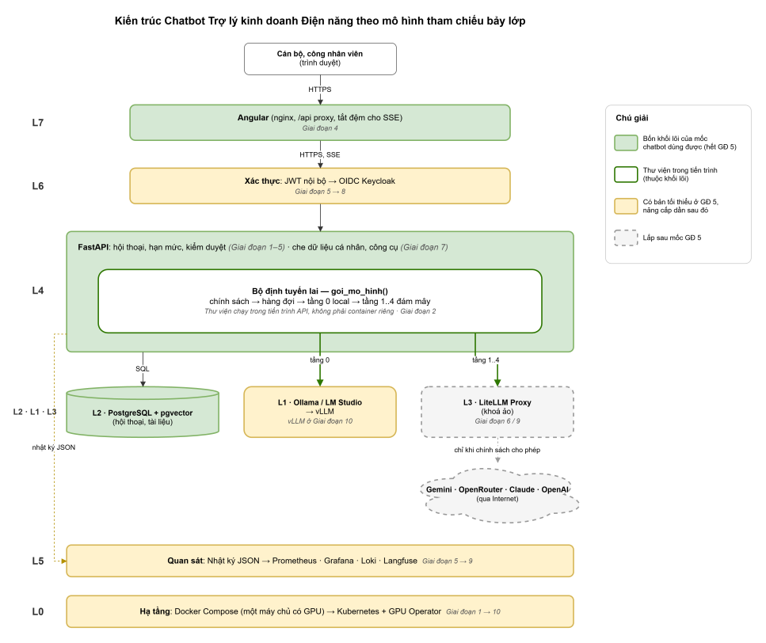

# PHẦN A: LẬP KẾ HOẠCH

## A.1. Sản phẩm làm gì và không làm gì

**Đơn vị sử dụng:** Doanh nghiệp kinh doanh điện năng.

**Người dùng:** cán bộ, công nhân viên của Doanh nghiệp kinh doanh điện năng, thuộc các phòng ban Kinh doanh,
Kỹ thuật, An toàn, Chăm sóc khách hàng và Công nghệ thông tin. Đây là trợ lý nội bộ, không phải chatbot trả lời
trực tiếp khách hàng. Mọi câu trả lời phải được thông qua một cán bộ trước khi công bố ra ngoài.

**Bài toán nghiệp vụ** chọn đúng bốn loại việc GenAI làm tốt:

| Loại việc | Ví dụ trong doanh nghiệp kinh doanh điện năng | Giai đoạn đáp ứng |
| --- | --- | --- |
| Trả lời câu hỏi lặp lại | Cách tính tiền điện sinh hoạt theo bậc thang; thành phần hồ sơ cấp điện mới | Giai đoạn 4, đầy đủ ở Giai đoạn 6 |
| Tra cứu trong khối văn bản lớn | Quy trình ngừng giảm cung cấp điện; quy định thanh toán tiền điện | Giai đoạn 6 (RAG) |
| Diễn giải số liệu thành lời | Viết nhận xét cho bảng sản lượng và doanh thu tháng | Giai đoạn 4; con số do công cụ tính ở Giai đoạn 7 |
| Chuẩn hoá văn bản tự do | Ghi chép cuộc gọi của khách hàng thành biểu mẫu phiếu yêu cầu | Giai đoạn 4 |

Ở mọi giai đoạn, trợ lý không làm bốn việc sau:

- Không tự tính con số rồi đưa ra như kết quả chính thức. Mọi con số do công cụ tính (Giai đoạn 7).
- Không thay người ra quyết định. Trần tự chủ là mức L2: AI chỉ tra cứu, diễn giải và soạn thảo; con người ký duyệt.
- Không tự biết quy trình nội bộ. Quy trình phải được nạp vào kho tri thức (Giai đoạn 6).
- Không gửi dữ liệu nhạy cảm ra đám mây. Chính sách định tuyến ở mục A.2 chặn việc này bằng mã, không trông vào sự
  cẩn thận của người dùng.

Phạm vi của mốc chatbot dùng được (hết Giai đoạn 5):

| LÀM | KHÔNG LÀM (và làm ở đâu) |
| --- | --- |
| Hội thoại nhiều lượt, nhớ ngữ cảnh trong phiên, báo cho người dùng biết khi đã lược bớt phần đầu | Tra cứu tài liệu nội bộ có trích dẫn → Giai đoạn 6 |
| Phát câu trả lời theo dòng, hiện vị trí hàng đợi và trạng thái nạp model | Gọi công cụ, truy vấn dữ liệu nghiệp vụ → Giai đoạn 7 |
| Model local là tầng mặc định; tự hạ cấp sang model nhỏ hơn khi quá tải | Đăng nhập một lần bằng tài khoản doanh nghiệp → Giai đoạn 8 |
| Rơi sang chuỗi đám mây 4 tầng khi local hỏng, nếu dữ liệu cho phép | Khoá ảo theo phòng ban, bảng theo dõi tập trung → Giai đoạn 9 |
| Đo token, chi phí và tốc độ từng lượt; chặn khi vượt trần ngân sách | Nhiều bản sao, nhiều GPU, tự mở rộng theo tải → Giai đoạn 10 |
| Đăng nhập tài khoản nội bộ, hạn mức theo người, nhật ký có mã truy vết | Tinh chỉnh model → Giai đoạn 11 |
| Chạy bằng một lệnh docker compose | Công cụ ghi dữ liệu, tự đặt lịch, tự gửi thư → ngoài phạm vi tài liệu |

Chỉ bắt đầu một giai đoạn sau Giai đoạn 5 khi có tín hiệu rõ ràng:

| Giai đoạn | Tín hiệu để bắt đầu |
| --- | --- |
| 6. RAG | Cán bộ hỏi về quy trình và văn bản riêng của doanh nghiệp; câu trả lời phải dẫn được về nguồn; tài liệu thay đổi vài lần mỗi năm |
| 7. Công cụ | Câu hỏi cần con số chính xác (tiền điện, sản lượng) hoặc cần tra dữ liệu nghiệp vụ |
| 8. Đăng nhập một lần | Từ khoảng 50 người dùng trở lên, hoặc cần phân quyền đọc tài liệu theo phòng ban |
| 9. Cổng AI và quan sát | Từ hai ứng dụng trở lên dùng chung model, hoặc cần quy đổi chi phí về từng phòng ban |
| 10. Kubernetes và vLLM | Có trên 5 người dùng đồng thời thường xuyên, hoặc cần chạy liên tục khi một máy chủ hỏng |
| 11. Tinh chỉnh | Bộ đánh giá cho thấy model sai VĂN PHONG hoặc ĐỊNH DẠNG lặp đi lặp lại, dù lời nhắc đã tối ưu |

## A.2. Chuỗi lai: một tầng local cộng bốn tầng đám mây

Mọi lời gọi model đi qua một hàm duy nhất là `goi_mo_hinh()`. Hàm này dựng chuỗi các tầng cần thử dựa trên ba thông
tin: chế độ định tuyến của hệ thống, nhãn dữ liệu của câu hỏi và cấu hình phòng ban của người hỏi. Sau đó hàm thử
lần lượt từng tầng cho tới khi có câu trả lời. Người dùng không cần biết chuyện gì xảy ra bên trong, nhưng giao diện
luôn hiện nhãn tầng và model đã trả lời.

| Tầng | Nhà cung cấp | Vai trò trong chuỗi | Vì sao ở vị trí này |
| --- | --- | --- | --- |
| 0 | Local: Ollama hoặc LM Studio. Bậc 1 là model chính, bậc 2 là model nhỏ | Phục vụ mặc định, giữ dữ liệu trong hạ tầng | Dữ liệu không rời doanh nghiệp, chi phí biên bằng không. Bậc 2 đỡ tải khi hàng đợi dài |
| 1 | Gemini | Dự phòng đầu tiên trên đám mây | Rẻ nhất trong nhóm model nhanh, độ trễ thấp, cửa sổ ngữ cảnh lớn |
| 2 | OpenRouter/auto | Dự phòng khi Gemini lỗi | Đi qua đường mạng và hạ tầng khác hẳn tầng 1, hiếm khi hỏng cùng lúc. Không tiền định nên chỉ làm dự phòng |
| 3 | Claude | Dự phòng chất lượng cao | Mạnh về suy luận dài và bám sát chỉ dẫn; giá cao hơn hai tầng trên |
| 4 | OpenAI | Tầng dự phòng cuối cùng | Hạ tầng ổn định. Đã rơi tới đây nghĩa là các tầng trước đều hỏng, phải cảnh báo ngay |

Ba chế độ định tuyến, đặt bằng biến `CHE_DO_DINH_TUYEN`:

| Chế độ | Thứ tự thử | Khi nào dùng |
| --- | --- | --- |
| local_truoc (mặc định) | 0 → 1 → 2 → 3 → 4 | Vận hành bình thường. Local phục vụ phần lớn lưu lượng; đám mây đỡ khi local quá tải hoặc hỏng |
| chi_local | Chỉ tầng 0 | Phòng ban xử lý dữ liệu khách hàng; hoặc khi chính sách doanh nghiệp cấm hẳn đám mây. Hết chuỗi thì trả câu "hệ thống đang bận" có kiểm soát |
| dam_may_truoc | 1 → 2 → 3 → 4 → 0 | Máy local yếu (GPU 6-8GB) mà cần chất lượng cao cho dữ liệu không nhạy cảm; local làm tầng dự phòng cuối cùng khi mất Internet |

**Luật phân loại dữ liệu** (đặt trong `config/chinh_sach_du_lieu.yaml`, áp dụng trước mọi quyết định định tuyến):

1. Câu hỏi chứa mã khách hàng, số điện thoại, số căn cước, số công tơ hoặc chỉ số công tơ được gắn nhãn
   `NHAY_CAM`. Việc phát hiện dùng biểu thức chính quy, chạy trước khi gọi model.
2. Phòng ban khai báo `chi_local` (mặc định là Chăm sóc khách hàng và Kinh doanh, hai phòng ban làm việc trực tiếp với dữ liệu khách hàng) thì mọi câu hỏi của người thuộc phòng ban đó đều
   là `NHAY_CAM`.
3. `NHAY_CAM` luôn đi chế độ `chi_local`, bất kể giá trị của `CHE_DO_DINH_TUYEN`. Có kiểm thử tự động khẳng định rằng
   không có lời gọi mạng nào tới nhà cung cấp đám mây trong trường hợp này.
4. Từ Giai đoạn 6, đoạn tài liệu có phạm vi đọc hạn chế cũng làm câu hỏi thành `NHAY_CAM`.

```batbuoc
Ba điều phải biết về chuỗi lai.
Một là pháp lý. Luật Bảo vệ dữ liệu cá nhân (hiệu lực 01/01/2026) có chế tài nặng với việc chuyển dữ liệu ra ngoài
trái phép. Vì vậy luật chi_local cho dữ liệu nhạy cảm là bắt buộc.
Hai là chi phí. Tầng local có chi phí biên bằng không, còn mỗi lượt rơi sang đám mây đều tốn tiền. Phải ghi lại tầng
nào đã phục vụ từng yêu cầu, và cảnh báo khi tỷ lệ rơi khỏi tầng 0 vượt 20% trong một giờ.
Ba là hành vi. Model local và bốn nhà cung cấp trả lời khác nhau về giọng văn, độ dài và cách giữ định dạng. Lời nhắc
hệ thống phải viết trung lập, và bộ câu hỏi đánh giá phải chạy trên từng tầng, không chỉ trên tầng đang phục vụ.
```

```meo
Tên model của mọi tầng, kể cả model local theo từng mức GPU, chỉ khai báo trong config/models.yaml (Phụ lục 2).
Tên model thay đổi rất nhanh. Mỗi quý rà lại một lần; nhờ đặt ở một chỗ, việc rà chỉ mất năm phút.
```

## A.3. Kiến trúc

Kiến trúc bám theo mô hình tham chiếu bảy lớp. Mốc chatbot dùng được (hết Giai đoạn 5) chỉ cần bốn khối: giao diện
Angular, API FastAPI, PostgreSQL và bộ định tuyến lai. Bộ định tuyến chạy bên trong tiến trình API dưới dạng thư
viện, không phải một container riêng. Các lớp còn lại được lắp dần theo giai đoạn.

```text
                    Cán bộ, công nhân viên (trình duyệt)
                                   |
          +------------------------v-------------------------+
  L7      |  Angular (nginx, /api proxy, tắt đệm cho SSE)     |  Giai đoạn 4
          +------------------------+-------------------------+
                                   |  HTTPS, SSE
          +------------------------v-------------------------+
  L6      |  Xác thực: JWT nội bộ → OIDC Keycloak             |  Giai đoạn 5 → 8
          +------------------------+-------------------------+
  L4      |  FastAPI: hội thoại, hạn mức, kiểm duyệt,         |  Giai đoạn 1–5
          |  che dữ liệu cá nhân, công cụ                     |  Giai đoạn 7
          |   +--------------------------------------------+  |
          |   | goi_mo_hinh(): chính sách → hàng đợi →     |  |
          |   | tầng 0 local → tầng 1..4 đám mây           |  |  Giai đoạn 2
          |   +--------------------------------------------+  |
          +-----+--------------+-------------------+---------+
                |              |                   |
  L2   PostgreSQL + pgvector   |     L3 LiteLLM Proxy (khoá ảo)       Giai đoạn 6 / 9
       (hội thoại, tài liệu)   |                   |
                |     L1 Ollama / LM Studio        Gemini · OpenRouter · Claude · OpenAI
                |     → vLLM (Giai đoạn 10)        (qua Internet, chỉ khi chính sách cho phép)
  L5   Nhật ký JSON → Prometheus · Grafana · Loki · Langfuse                 Giai đoạn 5 → 9
  L0   Docker Compose (một máy chủ có GPU) → Kubernetes + GPU Operator       Giai đoạn 1 → 10
```



Ánh xạ bảy lớp sang giai đoạn:

| Lớp | Thành phần | Giai đoạn |
| --- | --- | --- |
| L7 Trải nghiệm | Angular: khung chat, trích dẫn, bảng quản trị | 4, 6, 8 |
| L6 Danh tính và bảo mật | JWT nội bộ, rồi Keycloak OIDC; che dữ liệu cá nhân; OpenBao; quét Trivy | 5, 8, 9, 10 |
| L5 Quan sát và đánh giá | Nhật ký JSON, /chi-so, bộ đánh giá, rồi Prometheus, Grafana, Loki, Langfuse | 5, 9 |
| L4 Ứng dụng | FastAPI: hội thoại, hàng đợi, hạn mức, công cụ | 1-3, 7 |
| L3 Cổng AI | Bộ định tuyến trong tiến trình, rồi LiteLLM Proxy với khoá ảo theo phòng ban | 2, 9 |
| L2 Tri thức | PostgreSQL, rồi pgvector, Docling | 3, 6 |
| L1 Phục vụ model | Ollama hoặc LM Studio, rồi vLLM | 1, 10 |
| L0 Hạ tầng | Docker Compose, rồi Kubernetes với GPU Operator | 1, 10 |

## A.4. Câu hỏi hay gặp khi ra quyết định

| Câu hỏi | Trả lời |
| --- | --- |
| Vì sao frontend là Angular mà không phải trang HTML tĩnh như tài liệu gốc? | Trang tĩnh đủ cho một khung chat. Nhưng lộ trình cần đăng nhập OIDC, bảng quản trị, trang nạp tài liệu và khung trích dẫn. Angular có sẵn router, guard, interceptor và kiểu dữ liệu chặt, phù hợp đội phát triển doanh nghiệp. Chi phí của Angular là một bước build, và bước này được gói trong Dockerfile |
| Vì sao gọi local bằng httpx còn gọi đám mây bằng litellm? | Ollama và LM Studio đều có giao diện tương thích OpenAI, nên chỉ cần httpx là kiểm soát được chính xác các tham số riêng như keep_alive và num_ctx. Bốn nhà cung cấp đám mây có bốn kiểu API khác nhau, litellm chuẩn hoá chúng. Cả hai đều nằm sau một hàm goi_mo_hinh() |
| Vì sao không dùng EventSource ở Angular? | EventSource chỉ gửi được GET và không đính kèm được header Authorization. Luồng chat cần POST kèm token, nên dùng fetch và đọc ReadableStream |
| Vì sao chưa có LiteLLM Proxy từ đầu? | Với MỘT ứng dụng, thư viện chạy trong tiến trình làm đúng việc đó mà bớt được một container, một cổng mạng và một điểm hỏng. Dựng proxy riêng ở Giai đoạn 9, khi có từ hai ứng dụng hoặc cần khoá ảo theo phòng ban |
| Vì sao chưa có Redis? | Hàng đợi, hạn mức và semaphore chạy trong tiến trình là đủ khi chỉ có một bản sao. Redis bắt buộc khi chạy nhiều bản sao (Giai đoạn 9, tiền đề của Giai đoạn 10) |
| Vì sao Ollama rồi mới vLLM? | Ollama cài bằng một lệnh, hợp cho dưới 5 người dùng đồng thời. vLLM xử lý theo lô liên tục và quản lý bộ đệm KV theo trang, cho thông lượng cao hơn nhiều, nhưng cần GPU NVIDIA chuyên dụng. Cả hai đều có giao diện tương thích OpenAI, nên khi chuyển, ứng dụng chỉ đổi địa chỉ |
| Vì sao tinh chỉnh để cuối và chỉ tinh chỉnh văn phong? | Quy định thay đổi vài lần mỗi năm. Kiến thức nạp vào trọng số không gỡ ra được, còn RAG cập nhật chỉ cần thay tệp. Tinh chỉnh chỉ dạy văn phong và định dạng, không dạy nội dung quy định |
| Vì sao PostgreSQL ngay từ đầu? | Đổi cơ sở dữ liệu giữa chừng tốn hơn nhiều so với dùng PostgreSQL ngay. Hơn nữa, pgvector ở Giai đoạn 6 chỉ là đổi image, không phải thêm một hệ thống mới |

## A.5. Rủi ro, mức tự chủ và điều kiện dừng

Hồ sơ rủi ro lập theo bước MAP của khung quản trị rủi ro AI (NIST AI RMF), trả lời bảy câu hỏi:

| Câu hỏi MAP | Trả lời cho Trợ lý nội bộ |
| --- | --- |
| Giải quyết việc gì, cho ai? | Tra cứu, diễn giải, soạn thảo cho cán bộ, công nhân viên doanh nghiệp kinh doanh điện năng |
| Nếu sai, hậu quả tệ nhất là gì? | Cán bộ hướng dẫn khách hàng theo quy định đã hết hiệu lực, hoặc báo sai số tiền |
| Ai chịu hậu quả? | Khách hàng của doanh nghiệp, người không trực tiếp đặt câu hỏi. Đây là lý do có trần tự chủ L2 |
| Dữ liệu đầu vào từ đâu, ai bảo đảm đúng? | Kho tri thức do phòng ban nghiệp vụ quản lý, có trường tình trạng hiệu lực (Giai đoạn 6) |
| Người dùng kiểm chứng được không? | Có. Câu trả lời có trích dẫn tới điều, khoản, mục; con số có công cụ tính kèm theo |
| Hệ thống có thể bị lợi dụng thế nào? | Tiêm lời nhắc; dùng chatbot như cổng miễn phí; tải hoặc xoá model qua cổng Ollama bị phơi lộ; rò dữ liệu khách hàng ra đám mây |
| Mức tự chủ phù hợp? | Tối đa L2: soạn bản nháp, bắt buộc có người rà soát. Mọi nghiệp vụ chạm tới nghĩa vụ tài chính với khách hàng đều bị chặn ở L2 |

**Điều kiện dừng** (định nghĩa trước khi mở cho người dùng; người có thẩm quyền ra lệnh dừng là Trưởng ban Công nghệ
thông tin, phối hợp với chủ sở hữu nghiệp vụ):

- Phát hiện một lần trích dẫn tài liệu đã hết hiệu lực trong lĩnh vực an toàn hoặc giá điện → dừng tính năng tra cứu
  tài liệu, rà soát toàn bộ kho tri thức trước khi mở lại.
- Phát hiện dữ liệu nhãn NHAY_CAM đã đi ra nhà cung cấp đám mây → chuyển toàn hệ thống sang chi_local ngay, điều tra
  qua nhật ký có mã truy vết.
- Tỷ lệ đạt của bộ câu hỏi vàng giảm quá 10 điểm phần trăm so với lần chạy trước → không triển khai thay đổi đó.

```batbuoc
Chủ sở hữu nghiệp vụ phải được chỉ định trước dòng mã đầu tiên. Ban Công nghệ thông tin chịu trách nhiệm hệ thống
chạy; phòng ban nghiệp vụ chịu trách nhiệm câu trả lời đúng. Trợ lý không có chủ sở hữu nghiệp vụ thường chết sau
ba tháng: tài liệu không được cập nhật, chất lượng suy giảm âm thầm.
```

## A.6. Quy tắc đánh số phiên bản ứng dụng

Tài liệu chia việc theo giai đoạn, còn ứng dụng (backend, frontend và API) đánh số phiên bản theo
Semantic Versioning (SemVer) theo đặc tả tại https://semver.org/, dạng `MAJOR.MINOR.PATCH`:

| Thành phần | Tăng khi | Ví dụ |
| --- | --- | --- |
| MAJOR (số chính) | Thay đổi lớn về giao diện, kiến trúc hoặc tính năng, KHÔNG tương thích ngược với bản cũ | Đổi hẳn cơ chế đăng nhập nên ứng dụng tích hợp cũ phải sửa: 1.2.0 → 2.0.0 |
| MINOR (số phụ) | Thêm tính năng mới, vẫn tương thích ngược | Thêm tra cứu tài liệu có trích dẫn: 1.0.0 → 1.1.0 |
| PATCH (bản vá) | Chỉ sửa lỗi, vá bảo mật nhỏ hoặc tối ưu hiệu năng; không đổi và không thêm tính năng | Sửa lỗi cắt ngữ cảnh sai: 1.1.0 → 1.1.1 |

Có hai hậu tố tuỳ chọn. Bản phát hành thử nghiệm (pre-release) thêm dấu `-`, tên trạng thái và số đếm, dùng cho môi
trường thử nghiệm trước khi ra mắt chính thức, ví dụ `1.2.0-alpha.1`, `2.0.0-beta.3`, `1.0.0-rc.1`. Siêu dữ liệu bản
dựng (build metadata) thêm dấu `+` để ghi mã commit hoặc thời điểm build, ví dụ `1.0.0+20260922` hoặc
`1.0.0+sha.5114f85`; hậu tố này không ảnh hưởng thứ tự ưu tiên giữa các phiên bản.

Dự án áp dụng bốn quy tắc:

1. Giai đoạn 1-4 dùng số 0 ở đầu (0.y.z) vì đang phát triển ban đầu. Mọi thay đổi trong giai đoạn này đều có thể phá
   vỡ tính tương thích.
2. Hết Giai đoạn 5, ứng dụng chạy chính thức cho cán bộ, công nhân viên, nên phát hành 1.0.0. Trước đó phát hành
   `1.0.0-rc.N` cho nhóm dùng thử.
3. Backend và frontend dùng chung một số phiên bản, ghi ở `backend/pyproject.toml` và `frontend/package.json`; hai
   nơi luôn bằng nhau. Endpoint `/health` trả trường `phien_ban`, chân trang Angular hiện phiên bản kèm siêu dữ liệu
   bản dựng.
4. API có phiên bản riêng trong đường dẫn. Mọi endpoint nghiệp vụ nằm dưới tiền tố `/api/v1/`; riêng `/health`,
   `/ready` và `/docs` ở gốc để bộ kiểm tra sức khoẻ gọi. Tiền tố chỉ đổi sang `/api/v2/` khi hình dạng yêu cầu hoặc
   phản hồi thay đổi không tương thích, và khi đó `/api/v1/` được giữ song song ít nhất một giai đoạn. Trong Phần C,
   có chỗ đường dẫn nghiệp vụ viết rút gọn: `/chat/stream` nghĩa là `/api/v1/chat/stream`.

Phiên bản phát hành khi xong mỗi giai đoạn:

| Giai đoạn | Phiên bản | Vì sao tăng số đó |
| --- | --- | --- |
| 1. Khung dự án và luật chơi | 0.1.0 | Bộ khung đầu tiên |
| 2. Lõi định tuyến lai | 0.2.0 | Thêm lõi gọi model |
| 3. API chạy được | 0.3.0 | Thêm API |
| 4. Giao diện Angular | 0.4.0 | Mốc chatbot dùng được (MVP), chỉ dùng thử nội bộ |
| 5. Sẵn sàng cho người dùng thật | 1.0.0-rc.1 → 1.0.0 | Chạy chính thức cho người dùng thật |
| 6. RAG lai | 1.1.0 | Thêm tính năng; sự kiện `xong` chỉ THÊM trường trich_dan nên vẫn tương thích |
| 7. Gọi công cụ | 1.2.0 | Thêm tính năng tương thích ngược |
| 8. Đăng nhập một lần doanh nghiệp | 2.0.0 | Đổi cơ chế xác thực: token nội bộ được thay bằng token OIDC, ứng dụng tích hợp cũ phải sửa. Đường dẫn vẫn là `/api/v1/` vì hình dạng yêu cầu và phản hồi không đổi |
| 9. Cổng AI và quan sát | 2.1.0 | Thêm năng lực vận hành, API không đổi |
| 10. Kubernetes và vLLM | 2.2.0 | Đổi cách triển khai, API không đổi |
| 11. Tinh chỉnh model | 2.3.0 | Thêm một bậc model mới trong chuỗi |

Khi chốt một giai đoạn phải làm đủ bốn việc:

- nâng số phiên bản ở cả hai tệp;
- ghi `CHANGELOG.md` theo ba mục Thêm, Thay đổi, Sửa lỗi;
- gắn thẻ git `vX.Y.Z`;
- gắn thẻ `giai-doan-N` trỏ cùng một commit.

Sửa lỗi phát sinh giữa hai giai đoạn thì chỉ tăng PATCH.

```batbuoc
Không tăng MAJOR "cho đẹp" và không giấu thay đổi phá vỡ tương thích trong một bản MINOR. Ứng dụng khác của doanh
nghiệp gọi vào /api/v1/ dựa vào lời hứa tương thích của số phiên bản. Mọi thay đổi xoá trường, đổi tên trường hoặc
đổi nghĩa mã lỗi là thay đổi MAJOR của API.
```
